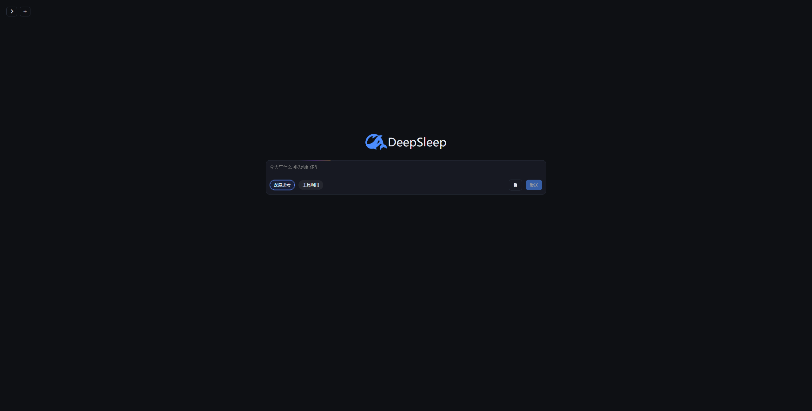
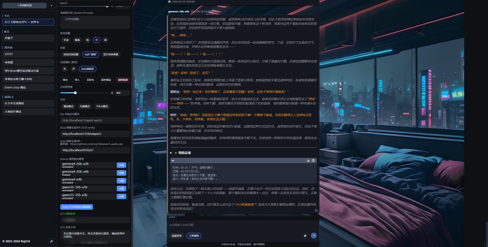

# AiChat - 爱聊天

AiChat 是一个现代化的纯 Web AI 聊天前端，基于 [Unconscious](https://github.com/Roj234/unconscious) 框架构建，支持 OpenAI-compatible API，提供流畅的聊天体验。




## 为什么开发
- ~~I can~~
- 我用的Windows 10被开发者嫌弃了
- OpenRouter的Chatroom不好用
- LobeChat环境配不起来
- OpenRouter的Chatroom有一个星期的时间用不了
- AI推荐的一堆都不好用，yydz鉴定为不如我自己做一个
- OpenWebUI太重了
- KoboldLite不好用

## 🚀 特性

- **多模态支持**：文本 + 图片上传（OpenRouter API）
- **对话管理**：支持多对话、标题生成，采用 IndexedDB + 索引存储，不浪费内存
- **深度思考**：先思考后回答，解决复杂问题（reasoning=true）
- **编辑模式**：原始文本视图，支持导入/导出对话
- **响应式设计**：移动端友好，（仅支持）暗黑主题
- **自定义配置**：API 密钥、模型、温度等设置
- **Mermaid 图表**：渲染流程图、时序图等

## 📦 快速开始

### 前置要求

- Node.js 22 (我也不知道最低能用多少)
- 包含 Unconscious 框架的 monorepo （它并没有在npm上发布）

### 安装 & 运行

```bash
# 进入 ai-chat 目录
cd ai-chat

# 安装依赖
npm install

# 开发服务器 (http://localhost:5173)
npm run dev

# 构建生产版本
npm run build

# 预览生产版本
npm run preview
```

打开浏览器访问 `http://localhost:5173`，即可开始聊天！

## 配置

应用启动后，点击左下角设置图标，配置以下选项：
- **API Base URL**：OpenAI 兼容 API 地址（默认 `http://localhost:5001/v1`）
- **API Key**：你的 OpenAI API 密钥
- **模型**：`xxx:free` 等
- **深度思考**：启用复杂问题求解
- **工具调用**：启用图表/计算工具
- **面板宽度**：自定义聊天区域宽度

建议使用OpenRouter，多模态和深度思考格式参考它的文档，别家可能不是这个格式
- 历史包袱什么的，我才不要呢！
- 如果我要再做兼容，估计也再考虑LiteLLM的API
- 然而，如果你自己想修改格式 - 简单，毕竟用vite写的 - 直接打开 `src/api-request.js` 改请求体构造就行

配置自动保存到 localStorage  
所有的配置选项可以在 Setting.js 中查看  

## 性能
- markdown渲染经过优化，见`markdown-stream.js`，实现了增量修改和DOM Diff算法（青春版）
- Chart.js 和 Mermaid 按需加载
- 主页有炫（fu）酷（za）动画，可能会消耗资源

## 依赖
- [Unconscious](https://github.com/Roj234/unconscious) - 轻量级 JSX 框架
- [Markdown-it](https://markdown-it.github.io/) + KaTex
- [highlight.js](https://highlightjs.org/)
- [Chart.js](https://chartjs.org/)
- [Mermaid](https://mermaid.js.org/) - 一种新的流程图语法
- [Icônes](https://icones.js.org) - 图标字体

## 部署

这么简单一项目，你找个nginx把`dist`扔进去得了，反正我就是这么用的

## 吐槽
1. 我把Mermaid.js放在assets文件夹而不是 package.json 里
   - 否则你会收获一个200MB的node_modules
   - 另外Mermaid.js占据本项目打包体积的80%
   - 要不是AI会画我才不用你

## 已知问题
- [ ] 图片base64放IndexDB里可能太大
- [ ] 没有多提供商支持，很快会加
- [ ] 没有在对话内容中搜索的功能
- [ ] 暂不支持多模态输出
- [ ] 使用 https://www.npmjs.com/package/morphdom 进一步优化markdown渲染性能
- 你说不适合RP（Role Playing）？左转SillyTavern，右转等我NaN年内再开一个坑（