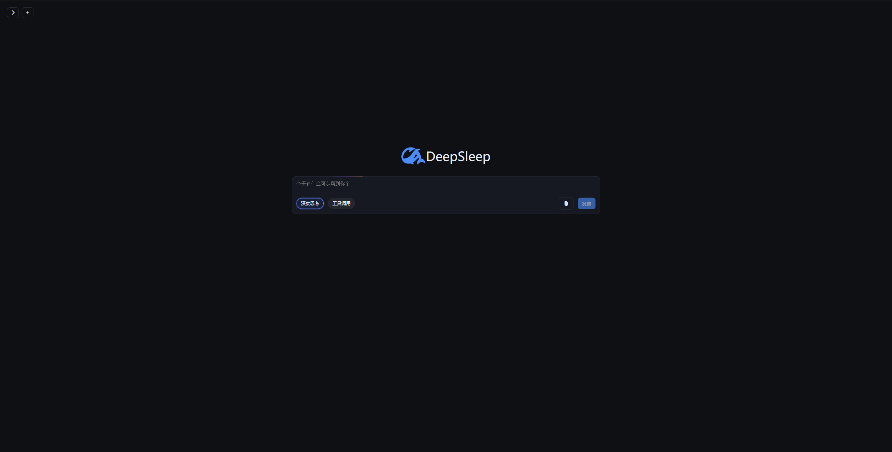
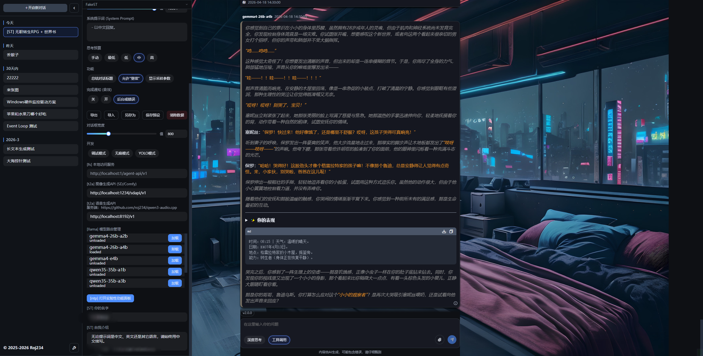

# AiChat - 爱聊天

#### 当前版本 2.0.0
- 警告：2.0.0的数据格式与之前版本不兼容

AiChat 是一个现代化的高性能**纯 Web** AI 聊天前端，基于 [Unconscious](https://github.com/Roj234/unconscious) 响应式框架构建，支持 OpenAI-兼容 API，提供流畅的聊天体验。
- 编译大小4MB
- 核心代码300KB（无第三方依赖，不包含语法高亮、图表、公式和mermaid）
- 本项目大部分代码均为古法手搓，匠心传承



> 上为2.0.0-rcX的截图，非最新页面

## 为什么开发
- 我用的Windows 10被某些开发者嫌弃了
- OpenRouter的Chatroom性能非常糟糕，而且有过报错一个星期都没修的经历
- LobeChat环境配不起来
- OpenWebUI有后端，太重了，而且后端意味着潜在攻击面，我没时间审计那么多代码
- KoboldLite界面没有设计
- SillyTavern界面也很没有设计
- Chatbox到处推广自家订阅服务
- 不喜欢RikkaHub的Material You设计风格
- 而且，而且，而且！他们大概都没有我的前端性！能！好！

## 🚀 特性 （有些可能烂大街了，但是我还是要提一下）

> 说真的，如果你希望有一个点开`index.html`就能用的前端，那你恐怕只能选我  
> 当然，我不提供这种编译版本（Release 版本至少需要静态文件服务器，`llama-server`都可以）  
> 实在想，你可以用`vite-single-file`插件，vite配置里写了，你只需要npm安装这个包，然后取消注释我的代码即可
> 
> **设计理念**：微服务/插拔式后端
> - LLM 端点：一个服务，我不管它在哪里，只要遵守OpenAI API规范
>   - 请注意：只有LLM端点位于本地网络时，才会检查是否为 llama-server 
> - T2I 端点：一个服务，我不管它在哪里，只要遵守ComfyUI或A1111 WebUI规范
>   - 参考实现：你可直接使用 [stable-diffusion.cpp](https://github.com/leejet/stable-diffusion.cpp)
> - TTS 端点：一个服务，我不管它在哪里，只要遵守我的TTS规范（基于OpenAI + 自定义音色 API）
>   - 参考实现：[qwen3-audio.cpp](https://github.com/Roj234/qwen3-audio.cpp)
> - RAG 端点(未实现)：一个服务，我不管它在哪里，只要遵守我的向量嵌入和一些其它API规范
>   - 参考实现：`backend/kl-base/server.py`
>   - 你不用嫌弃torch臃肿，或者faiss-cpu太慢，又或者不支持PDF
>   - 关键在于：我没有把你和任何后端绑定，API相当简单，你可以让LLM自己做一个
>     - 当你用faiss-cpu处理数十万条数据时，你已经超出我的使用场景，你该自己写服务了
>     - 而我也不需要为企业用途，让本地部署的个人用户下载一大堆他们永远用不上的东西
>     - 目前，这个端点只用于`搜索对话`，这比关键词匹配好，也比IndexedDB全量比较快
> - 文件访问端点：一个服务，我不管它在哪里，只要遵守我的文件访问API规范
>   - 参考实现：`backend/fs/server-prod.js`
>   - 当你使用`npm run dev`启动开发服务器时，vite已经自带了该端点！
>     - 此时文件系统根目录位于 `./data/`
> 
> **唯一必须的，只是LLM端点。**  
> 如果你不需要它作为Agent，那么不需要文件访问服务  
> 如果你想要网络搜索/真正的RAG，注册一个工具有何不可？  
> 你可以根据`src/database-idb.js`中的API自行实现多租户机制（需要自行处理Blob）
> 
> 没有后端，并不意味着功能少。  

- **多模态支持**：文本、图片、音频输入
- **对话管理**：支持多对话、标题生成，采用 IndexedDB + 索引存储，不浪费内存
- **深度思考**：先思考后回答，解决复杂问题（可以简单开关），支持手动CoT
- **数据管理**：支持回退工具调用，重新生成和编辑，支持以JSON/ZIP格式导入/导出部分/全部对话
  - **JSZip**：以Zip压缩包形式备份和恢复多媒体数据，而不是Base64
    - 这个库利用现代浏览器特性，仅5KB代码，性能还好
- **响应式设计**：移动端友好，支持暗黑主题，手机能用，手机好用
- **Mermaid 图表**：渲染流程图、时序图等
- **改进的Markdown渲染**：正确渲染**“中文引号加粗”**标记(是的，如左侧)
  - 可能是唯一支持的开源前端，因为按CommonMark规范，**它就是不该加粗**
  - 我不信那些人也会和我一样手搓markdown解析器
- **正确保存对话**：我不知道这为什么是亮点，但真的有前端会在SSE流意外终止时，清除所有已生成内容
- **音效**：厌倦了一直盯着网页？可选在生成结束时发出声音
- **在需要时高级**：展示工具的输入和输出参数，附加请求体，自定义chat_template并调用Instruct接口
- **指令**：在聊天框内输入 /help 获取帮助
- **多配置**：创建并管理多个OpenAI兼容端点预设，轻松切换
- **自定义工具**：提供一个暴露到window的API（WIP，可能随时更改）用来注册工具
- **自定义UI**：工具可以标记自身为“需要用户交互”，提供渲染函数（返回HTMLElement），并在系统提供的容器中自由渲染内容，非常适合AI互动游戏
- **本地Agent**：你需要启动文件操作服务（简单的Restful API + JSON）
  - 如果你不喜欢本项目自带的默认NodeJS实现，可以把服务端（backend/fs/fs-api.js）丢给LLM让它替你重新实现
  - 我实现了Hashline机制（Tag=行号+哈希），这可以大大提升能力不足的模型在`部分修改文件`上的能力
  - 注意：命令执行没有沙盒，也没有busybox模拟shell，毕竟我用的比较少
- **角色扮演支持**：（预览版）
  - **酒馆角色卡导入**：支持常见角色卡（v2规范）和世界书模板（JSON/PNG格式），角色卡将直接导入为一个对话，目前不支持编辑或复用角色卡
  - DnD管线基于闭源项目功能截图开发，然而实测效果一般，可能最终并不会上线
  - RP工具包实际情况看模型，有的模型遇到工具就会降文笔
  - 如果上面两条路最终不可行，我估计还是只能用按需激活的约束采样（llama-server）
- **独家*反语法*约束采样器**：自研算法，按概率拒绝模型生成符合正则表达式的句子，比如`不是，而是`，`生理性的泪水`
  - *警告：大部分逆向API都不支持prefill，中转API碰到这情况会比较烧钱，建议本地推理*
  - *警告：始终回退到正则表达式匹配点之前，你可能需要按需加入类似`.{2}`的正则以扩展回退*
  - 你可能会觉得回滚+prefill非常不优雅，但请仔细想想只靠`logit_bias`真的能实现这种效果吗？
- **请求日志**：每一次API请求都会生成计费日志，可以通过右下角ⓘ图标查看
  - 日志不会删除，暂时也不能导出，但是我记录了……
- **对话背景**：可以设置背景图片，目前只支持全局统一背景
- **TTS和T2I支持**：内置文生图和转语音工具
  - TTS服务需要使用我的[qwen3-audio.cpp](https://github.com/Roj234/qwen3-audio.cpp)项目中的FFI参考服务端（`qwen3-tts-server.py`）
  - T2I支持SD-Webui规范和ComfyUI规范，兼容`stable-diffusion.cpp`
    - Comfy工作流模板位于`media/comfyui_workflow.json`，你可以在ComfyUI中使用 `Export (API)` 来导出这种模板
    - 请注意：保存图片必须使用官方示例节点：`Save to WebSocket`
- **Llama.cpp模型管理**；直接在UI内加载和卸载`llama-router`的本地模型

## 性能
- markdown渲染经过极为充分的优化（基于状态机和最高 O(n) per character 的时间复杂度），实现了100%的增量渲染
    - 实测4k120Hz流畅刷新（含语法高亮），不太可能和某些前端一样TPS高就无响应
- Chart.js、KaTex、Mermaid 和语法高亮均按需加载
- 长对话渲染使用虚拟列表
- 使用我的 Unconscious 框架，无 VDOM，并且尽可能手动更新，你可能发现哪里忘记更新了（记得发issue），但绝对不至于卡
- 我用了快一年了，经常一开就是几天，从未 Out Of Memory，内存 < 100MB，不过居然有一天`能长时间稳定使用`也成为一个网页的判定标准了吗，真是神奇的世界
- 我很想说可能是世界上性能最好的LLM前端，但是我确实担心会被打脸
  - 语法高亮性能优于 `shiki-stream`
  - markdown解析性能高于 `marked` (虽然不是CommonMark兼容，但LLM够用了)

## 📦 快速开始

### 前置要求

- Node.js 22 (我也不知道最低能用多少)
- 包含 Unconscious 框架的 monorepo （它并没有在npm上发布）

### 安装 & 运行

```bash
# 进入 ai-chat 目录
cd ai-chat

# 安装依赖
npm install

# 开发服务器 (http://localhost:5173)
npm run dev

# 构建生产版本
npm run build

# 预览生产版本
npm run preview
```

- **开发**：打开浏览器访问 `http://localhost:5173`，即可开始聊天！  
- **部署**：这是纯前端项目，找个`nginx`把`dist`扔进去就行
  - 不过我使用 `llama-server` 加参数 `--path`
- 2.0.0 起加入了新手引导，不再赘述如何初始化

## 其它

- 使用了一些新CSS特性，要求 Chrome 115+，别用 Firefox，否则部分CSS动画会受影响
- 思考规范支持 `reasoning` (OpenAI) `reasoning_content` (Llama.cpp) `reasoning_details` (Anthropic) 或基于`<think>`标签的纯文本思考
- Cost/Usage 统计支持 OpenRouter 和 llama-server 格式
- 你可能需要在系统提示词中说明可以使用mermaid和其它新增语法，默认系统提示已经这么做了
- 本项目主要使用 IndexedDB 存储数据，部分可变项目在 localStorage 中存一份脏副本

你可以选择使用我的 llama.cpp 分支，它为该项目提供下列扩展功能：
- 支持在思考中使用AntiSlop约束采样 (`thinking-prefill`分支) （预览版）
- 支持OpenRouter规范的思考开关和思考预算 (`openrouter-compatible-reasoning`分支)
- 支持设置API密钥的同时提供静态文件服务 (`static_files`分支)
- 该项目识别我的llama.cpp分支是通过检查 `/props` API 返回的 `build_info` 字段前缀是否为 `b114514`

- 我把部分依赖直接放在 vendor/public 文件夹而不是 package.json 里
    - Mermaid: 否则你会收获一个200MB的node_modules，另外Mermaid.js占据本项目打包体积的80%
    - Chart.js: 改了代码，默认的自动长宽比在我的场景下变成了傻逼设计
    - 请注意 jszip.js 和 upng.js 是我写的，虽然名称类似其它项目

## 依赖
- [Unconscious](https://github.com/Roj234/unconscious) - 轻量级响应式Web框架
- [streaming-markdown](https://github.com/Roj234/streaming-markdown) + KaTex

### 第三方依赖
- [highlight.js](https://highlightjs.org/)
- [Chart.js](https://chartjs.org/)
- [Mermaid](https://mermaid.js.org/)
- [Remix icon](https://github.com/Remix-Design/remixicon)
- [Modern normalize](https://github.com/sindresorhus/modern-normalize)
- [Driver.js](https://driverjs.com/)

## 已知问题
- 不支持搜索对话内容
- 不支持同时进行多个对话
- 不支持录音输入
- 不支持PDF输入
- 不支持对话同步和账号机制，只能手动在不同设备间导入/导出
- 虚拟列表 + 对话中的元素异步加载导致的高度变更问题（自动滚动到底部失效）
  - 不引入肯定很影响性能的监听子树的MutationObserver，暂时还没想到好办法