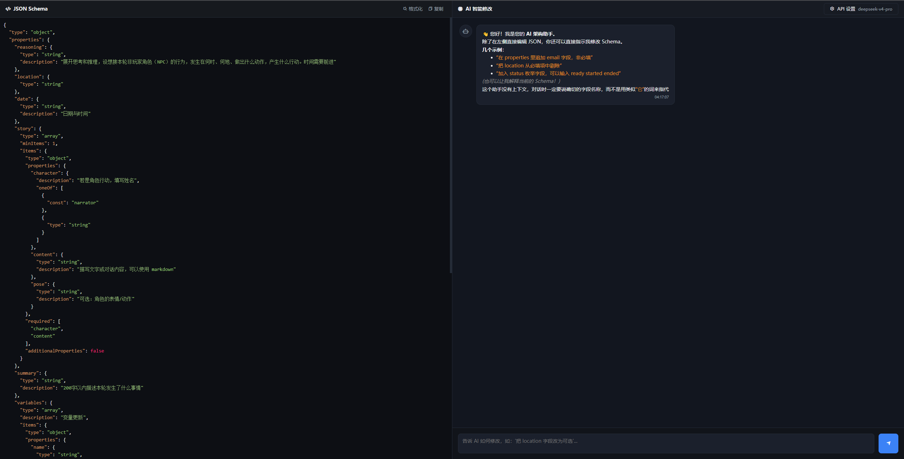

# AiChat - 爱聊天

AiChat 是一个现代化的高性能纯 Web AI 前端，基于 [Unconscious](https://github.com/Roj234/unconscious) 响应式框架，支持 OpenAI-兼容 API，提供流畅的聊天体验。
- **你可以在任何能运行浏览器的设备上使用 AiChat，不需要 Docker，不需要 Python 环境，不需要数据库——你的敌人只有 CORS。**
- AiChat 性能很好，AiChat 后端可选，AiChat 界面好看；这是我开发它的理由，我未能在 GitHub 找到适合我的 LLM 前端
- 前端(gzipped) 1.5MB 可选后端(+所有依赖) 650KB

> 说真的，如果你希望有一个点开`index.html`就能用的前端，那你恐怕只能选我  
> 尽管我没有提供真正的`即点即用`版本，因为ESM按需导入不支持 `file://` —— 至少要一个静态文件服务  
> 你可用`vite-single-file`插件自行构建即点即用版本  
> BTW, 我很快会用 GitHub pages 部署一个云端版本

## 🚀 特性

- **高性能**：
  - 使用无 VDOM 的自研框架，内存占用很低
  - 我自己就是它的深度用户，页面一开就是几天，从未 Out Of Memory，内存几乎不超过 100MB
     - 你可能会说这很显然，但这不显然，我用的是32位的chrome，相当一部分垃圾网站会内存溢出（> 1GB）
     - 例如DeepSeek网页版或者模搭社区
  - markdown渲染经过极为充分的优化（基于状态机和最高 O(n) per character 的时间复杂度），实现了100%的流式渲染
    - 解析性能高于 `marked` (虽然不是CommonMark兼容，但更适合LLM)
  - 语法高亮性能优于 `shiki-stream`
    - 在数百TPS下流畅更新不丢帧，不会和某些前端一样TPS高就无响应甚至崩溃
  - 对话和代码块使用虚拟列表
  - Chart.js、KaTex、Mermaid 和语法高亮均按需加载，入口文件仅 200KB
  - 我很想说可能是世界上性能最好的LLM前端，但绝对会被打脸吧！
- **并发对话**：同时进行多个对话，他们在后台运行，互不干扰
- **思考开关**：通过一个按钮开关模型的思考能力，支持手动CoT
- **压缩导出**：以Zip格式导出对话数据中的多媒体（图片、音频等），而且不依赖第三方API
- **响应式设计**：移动端友好，支持暗黑主题，手机能用，手机好用
- **Mermaid 图表**：渲染各种Mermaid图表
- **改进的Markdown渲染**：正确渲染**“中文引号加粗”**标记(是的，如左侧)
  - 可能是唯一支持的开源前端，因为按CommonMark规范，**它就是不该加粗**
- **音效**：厌倦了一直盯着网页？可选在生成结束时发出声音
- **角色扮演（AIRP）**：导入酒馆的角色卡、世界书和预设（JSON/PNG格式），并配有现代化的响应式编辑器
  - 快速菜单一键切换预设和世界书
  - 基于工具调用的全新世界书实现，在支持工具调用的模型上表现远好于传统正则/字符串匹配
- **AntiSlop采样器**：自研算法，从源头防止模型生成八股，比如`不是，而是`，`生理性的泪水`
- **请求日志**：每一次API请求都会生成计费日志，可以通过消息右下角ⓘ图标查看，或在日志查看器中统计
- **TTS和T2I支持**：内置文生图和转语音工具
- **可选的后端**：
  - 绝大部分的功能都靠前端实现，后端比起SpringBoot，更类似Postgres
  - 数据默认保存在本地`IndexedDB`中
  - 后端扩展功能：
    - **多用户**：但是**没有任何鉴权**，只有用户名没有密码
    - **数据同步**：使用SQLite储存，支持序列化和反序列化Blob、Set等类型
    - **多端协作**：使用WebSocket和悲观锁，消息可以在所有相同用户的客户端上自动流转和解决冲突，无需刷新页面
    - **断线重连**：后端代理OpenAI兼容SSE请求，客户端掉线不会导致回复终止
    - **对话内容搜索**：IndexedDB版本同样实现了该端点，但IndexedDB不支持全文索引，只能全表扫描，性能会很差
    - **Agent**：提供命令执行功能
      - 更建议你在容器中运行后端的独立Agent模式（通过 --workspace &lt;path> 命令行参数），以防止恶意/意外的命令
  - 没有密码也是一种优势
    - 如果暴露到公网，你一定会在前面套一个专业的、十年开发历史的SSO和鉴权组件，而不是选择相信我，或者其他项目（而且真出CVE了也很好换）
    - 同时，你也不需要在家里研究怎么样让自己的老妈记住`必须包含字母数字特殊符号的14位密码`
  - 如果需要高级功能（超过部署在NAS上为一家人提供服务），请自行二次开发
- **本地Agent**：修改本地文件，运行命令
   - **基于浏览器文件系统API**，你甚至**不需要后端**就能拥有本地 Agent
   - 虽然无法运行命令，且Glob遍历目录性能非常差，但它存在，从未有人像我一样这么发挥浏览器的潜力
   - 当然，也可以（并且推荐）使用后端执行
   - 我实现了Hashline机制（Tag=行号+哈希），这可以大大提升能力不足的模型在`部分修改文件`上的能力
     - 但不一定更好
  - 命令执行没有沙盒，你**可以而且应该**在容器内部署一个文件操作服务
- **真正的编辑**：“你不能只在自己红温的时候支持模型应该能被打断和修改”  
  传统 Agent 的工作流是线性的、自动的、不可逆的。  
  本项目允许你修改历史中任何一条消息的思考，内容，工具调用参数和结果
   - “就当它成功过”
   - [详细介绍](public/documents/agent-filesystem.md)

> 2.0.0 的截图，新版本有不少改动

## 理念

### 1. 在任何可能引入外部重依赖的地方，我用一层抽象把选择权交还给你  
本项目所需的后端如下

- LLM 端点：OpenAI API规范
  - 请注意：只有LLM端点位于本地网络时，才会检查是否为 llama-server
- T2I 端点：ComfyUI或A1111 WebUI规范
  - 参考实现：你可直接使用 [stable-diffusion.cpp](https://github.com/leejet/stable-diffusion.cpp)
- TTS 端点：我的TTS规范（基于OpenAI + 自定义音色 API）
  - 参考实现：[qwen3-audio.cpp](https://github.com/Roj234/qwen3-audio.cpp)
- 数据库端点：我的数据库API规范
  - 参考实现：`backend/init.js`
- 文件访问端点：我的文件访问API规范
  - 参考实现：`backend/init.js`

> **唯一必须的，只是LLM端点。**  
> 如果你不需要它作为Agent，那么不需要文件访问服务  
> 如果你想要网络搜索/真正的RAG，注册一个工具有何不可？  
> 如果我的naive实现满足不了你日益增长的需求，尝试做一个更好的，而不是让我做一些自己用不上的功能（比如鉴权）

[我的 llama.cpp 分支](https://github.com/Roj234/llama.cpp) 提供下列可选功能：
- 支持 OpenAI 规范的思考开关和思考预算字段
- 支持 JSON Schema 消息预填充

### 2. 在需要的时候高级

1. AiChat 支持展示工具的参数和结果，编辑各种原始数据，预览请求体，甚至自定义 `chat_template`
2. 在聊天框内输入 `/help` 获取指令帮助
3. **RPG管线**：一个基于AI的角色扮演游戏框架 *（开发中）*
   > 目前的 RP 预设依赖于“祈祷”——祈祷模型能记住 XML 标签，祈祷它不漏掉闭合括号，甚至祈祷它在复述几十 KB 的样板代码时不发疯。我们结束这种混乱。
   >
   > 我们使用**约束采样**：所有的非法 logits 在采样阶段就被过滤。模型**永远**不会忘记格式，**永远**不会生成错误的 JSON。
   >- **注意力的回归**：当你还在让模型背下复杂的XML标签，一不小心又没闭合，第十次重新生成，你暴跳如雷时，我们将格式交给了数学。模型 100% 的注意力都用于推演剧情，而不是去背诵标签。
   >- **Token不浪费**：只需要类似 TypeScript+JSDoc 的极简格式注解就可正确生成对象。
   >- **极高的兼容性**：几乎所有开源闭源模型的API支持通过约束采样生成完美的JSON
   - 基于 JSON schema, 工具调用, response_format 和 `世界对象模型` 创建你的AI角色扮演游戏 比如 Galgame/TRPG
   - 现已推出带流式和前端的对话版本，[详见此处](public/documents/rpg-pipeline.md)
   - 提供骰子和数据管理之类的工具
4. **Llama.cpp模型管理**；直接在UI内加载和卸载`llama-router`的本地模型
5. **插件系统**：大部分工具甚至包括角色扮演支持都支持异步导入

## 📦 快速开始

### 环境要求
- Node.js 22+ (建议 Node 24 LTS)

### 部署

请从 Release 下载构建好的版本，它是 Github Action 自动构建的  
如果你想手动构建或开发，[请查看这里](public/documents/build.md)

下载后直接点击 launch.bat / launch.sh 就可以启动了  
下载的版本是自带后端的，启动的也是后端  
默认的端口是 3000，你可以加入 `-p <端口> --data <数据目录>` 参数修改

你可以把它部署在任何静态文件服务器上：
- 使用Github pages的[在线版本](https://roj234.github.io/ai-chat/)
- 找个`nginx`把`dist`扔进去就行
- 使用 `llama-server` 加参数 `--path`
- 基于WebView的安卓应用程序(未实现)

## 依赖
- [Unconscious](https://github.com/Roj234/unconscious) - 轻量级响应式Web框架
- [streaming-markdown](https://github.com/Roj234/streaming-markdown) + KaTex

第三方依赖
- [Remix icon](https://github.com/Remix-Design/remixicon)
- [Modern normalize](https://github.com/sindresorhus/modern-normalize)
- [Driver.js](https://driverjs.com/)

这些打包在项目里
- [highlight.js](https://highlightjs.org/): 改成生成器函数（什么你问我为啥不用shiki，包大小和流式响应性能啊兄弟！）
- [Chart.js](https://chartjs.org/): 改了代码，默认的自动长宽比在我的场景下变成了傻逼设计
- [Mermaid](https://mermaid.js.org/): 否则你会收获一个200MB的node_modules，另外Mermaid.js占据本项目打包体积的80%

### 鸣谢
- [DsChat](https://github.com/huzpsb/DsChat)
  - 你不能只在自己红温的时候支持模型应该能被打断和修改
  - 本项目允许你修改工具调用的名称、参数和结果，以及Human as tool的*灵感*完全来自该项目

## 已知问题/TODO清单
- 名字没有SEO很烂大街
  - 我知道这是个问题，但是AI想的名字还不如这个。
- 不支持录音输入
  - 浏览器貌似只支持webm格式
- 不支持PDF输入
  - pdf.js 又是 114514KB 的庞然大物
- 前端网络不好可能导致流式响应中断/浏览器直接请求暴露了我的网址、CORS问题等各种和fetch有关的……
  - 前端没办法，请使用可选的后端。
  - 你也可以试试NewAPI
- Orchestrator / Subagent

### 管理聊天中的历史多媒体文件
- IndexedDB后端不支持去重和附件管理，这个暂时没法解决
- SQLite后端没有引用计数，需要手动在GUI内管理和删除
- 不支持创建和编辑文本文件，不然能把某些前端的知识库功能吃掉

## 其他页面

### 请求和计费日志查看器
- 暂时必须使用后端
- 因为本项目的数据库驱动程序比较耦合，暂时还拆不出来

### AI原生 JSON Schema 编辑器
- 所谓 AI Native，指编辑器的主要功能就是 AI，你可以和 AI 聊天让它修改 Schema
- 目前还不支持回退，也不支持多轮对话，但是对我来说已经算比较好用了
- 不支持多轮对话的主要代价是，每次你需要明确的提出要修改的字段名，而不能用“之前”，“它”，“然后”什么的，其他倒是没什么

