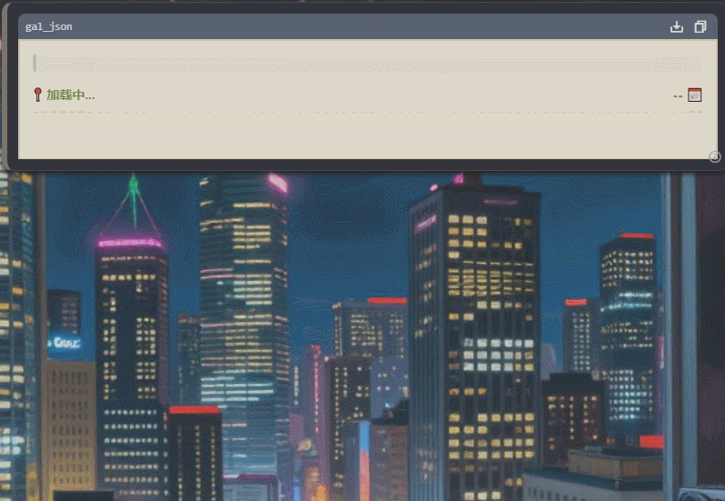

# AiChat - 爱聊天

AiChat 是一个现代化的高性能纯 Web AI 前端，基于 [Unconscious](https://github.com/Roj234/unconscious) 响应式框架，支持 OpenAI-兼容 API，提供流畅的聊天体验。
- **你可以在任何能运行浏览器的设备上使用 AiChat，不需要 Docker，不需要 Python 环境，不需要数据库——你的敌人只有 CORS。**
- AiChat 性能很好，AiChat 后端可选，AiChat 界面好看；这是我开发它的理由，我未能在 GitHub 找到适合我的 LLM 前端
- 前端(gzipped) 1.5MB 可选后端(+所有依赖) 650KB

> 说真的，如果你希望有一个点开`index.html`就能用的前端，那你恐怕只能选我  
> 尽管我没有提供真正的`即点即用`版本，因为ESM按需导入不支持 `file://` —— 至少要一个静态文件服务  
> 你可用`vite-single-file`插件自行构建即点即用版本  
> BTW, 我很快会用 GitHub pages 部署一个云端版本


> 2.0.0 的截图，新版本有不少改动

## 🚀 特性

**设计理念**：微服务/插拔式后端
- LLM 端点：OpenAI API规范
  - 请注意：只有LLM端点位于本地网络时，才会检查是否为 llama-server 
- T2I 端点：ComfyUI或A1111 WebUI规范
  - 参考实现：你可直接使用 [stable-diffusion.cpp](https://github.com/leejet/stable-diffusion.cpp)
- TTS 端点：我的TTS规范（基于OpenAI + 自定义音色 API）
  - 参考实现：[qwen3-audio.cpp](https://github.com/Roj234/qwen3-audio.cpp)
- 数据库端点：我的数据库API规范
  - 参考实现：`backend/init.js`
- 文件访问端点：我的文件访问API规范
  - 参考实现：`backend/init.js`

> **唯一必须的，只是LLM端点。**  
> 如果你不需要它作为Agent，那么不需要文件访问服务  
> 如果你想要网络搜索/真正的RAG，注册一个工具有何不可？  

在任何可能引入外部重依赖的地方，我用一层抽象把选择权交还给你  
> 如果你觉得我的naive实现不好，那就override它吧  
> 随便哪个2026年的LLM（例如DeepSeek V4P or Gemini3F）都能在一轮对话内按照这些API规范生成实现

- **多模态支持**：文本、图片、音频输入
- **对话管理**：支持并发对话、对话分支、生成标题，采用 IndexedDB/SQLite + 索引存储，不浪费内存
  - 不浪费内存指不会在每次打开网页时将所有对话读取到内存
  - 你说什么这不是编程常识吗？不好意思真有人的前端会一次读取所有历史对话
- **深度思考**：先思考后回答，解决复杂问题（可以简单开关），支持手动CoT
- **数据管理**：支持回退工具调用，重新生成和编辑，支持以JSON/ZIP格式导入/导出部分/全部对话
  - **JSZip**：以Zip压缩包形式备份和恢复多媒体数据，而不是Base64
    - 这个库利用现代浏览器特性，仅5KB代码，性能还好
- **响应式设计**：移动端友好，支持暗黑主题，手机能用，手机好用
- **Mermaid 图表**：渲染流程图、时序图等
- **改进的Markdown渲染**：正确渲染**“中文引号加粗”**标记(是的，如左侧)
  - 可能是唯一支持的开源前端，因为按CommonMark规范，**它就是不该加粗**
  - 我不信那些人也会和我一样手搓markdown解析器
- **正确保存对话**：我不知道这为什么是亮点，但真的有前端会在SSE流意外终止时，清除所有已生成内容
- **音效**：厌倦了一直盯着网页？可选在生成结束时发出声音
- **在需要时高级**：展示工具的输入和输出参数，附加请求体，自定义chat_template并调用Instruct接口
- **指令**：在聊天框内输入 /help 获取帮助
- **多配置**：创建并管理多个OpenAI兼容端点预设，轻松切换
- **自定义工具**：提供一个暴露到window的API（WIP，可能随时更改）用来注册工具
- **自定义UI**：工具可以标记自身为“需要用户交互”，提供渲染函数（返回HTMLElement），并在系统提供的容器中自由渲染内容，非常适合AI互动游戏
- **本地Agent**：你需要启动文件操作服务（简单的Restful API + JSON）
  - 如果你不喜欢本项目自带的默认NodeJS实现，可以把服务端（backend/routes/fs.js）丢给LLM让它替你重新实现
  - 我实现了Hashline机制（Tag=行号+哈希），这可以大大提升能力不足的模型在`部分修改文件`上的能力
    - 但不一定更好
  - 注意：命令执行没有沙盒，你可以并且应该在*你喜欢的容器内*自行启动一个文件操作服务
- **完全的编辑模式**：“你不能只在自己红温的时候支持模型应该能被打断和修改”  
传统 Agent 的工作流是线性的、自动的、不可逆的：
  - 模型调用工具 → 出错了？重来。
  - 上下文偏了？插一条 user 消息，但之前的错误响应甚至思考已经污染了历史。
  - 想改初始消息？请结束对话重新开始。

  所以，我和DsChat允许你：
  - 修改历史中任何一条工具调用的参数和结果（“就当它成功过”）。
  - 修改模型的思考过程（纠正错误推理，而不只是纠正输出）。
  - 动态修改系统提示（让 Agent 即时转变目标）。
  - 用“人类工具”将人变成 Agent 可调用的工具，比如 find_import——人直接告诉模型结果，而不需要它自己去读文件搜索。
    - （该功能尚未通过GUI实现，只有API）
  - 没有任何其它Agent支持（你可以去看看鸣谢中的DsChat，它必须后端，只支持DeepSeek，有更多网络爬虫工具）
  - 你说这像单步调试，***But WHY NOT ?***
- **角色扮演支持**：
  - **酒馆角色卡导入**：支持角色卡、世界书和预设（JSON/PNG格式），并配有现代化（至少比酒馆自己现代）的响应式编辑器
    - 快速菜单一键切换预设和世界书
    - 基于工具调用的全新世界书实现，在支持工具调用的模型上表现远好于传统正则/字符串匹配
      - 逆向API不支持工具调用的那种就洗洗睡吧
    - **目前只支持从酒馆转换，并以我自己设计的格式导出**
    - 后续我可能会写逆向转换工具，但会是独立的HTML
  - RPG管线是一个基于AI的角色扮演游戏框架 *（预览版，仅在开发模式存在）*
    - 懂JavaScript的可以使用这个框架简单的创建你的AI角色扮演游戏
    - 基于 JSON schema, 工具调用 和 response_format
    - 现已推出带流式和前端的对话版本，[见此处](#rpg管线-第一部分真正的前端角色卡-mvp)
  - RP工具包提供了骰子和数据管理器之类的工具 *（预览版，我还没想好怎么用系统提示词或者tool_choice来“完美”实装）*
    - 和统计学模型讲完美？但是我们有**约束采样**！ 
- **独家*反语法*约束采样器**：自研算法，按概率拒绝模型生成符合正则表达式的句子，比如`不是，而是`，`生理性的泪水`
  - *警告：大部分逆向API都不支持prefill，中转API碰到这情况会比较烧钱，建议本地推理*
  - *警告：始终回退到正则表达式匹配点之前，你可能需要按需加入类似`.{2}`的正则以扩展回退*
  - 你可能会觉得回滚+prefill非常不优雅，但请仔细想想只靠`logit_bias`真的能实现这种效果吗？
- **请求日志**：每一次API请求都会生成计费日志，可以通过右下角ⓘ图标查看
  - 日志不会删除，暂时也不能导出，但是我记录了……
- **对话背景**：可以设置背景图片，目前只支持全局统一背景
- **TTS和T2I支持**：内置文生图和转语音工具
  - TTS服务需要使用我的[qwen3-audio.cpp](https://github.com/Roj234/qwen3-audio.cpp)项目中的FFI参考服务端（`qwen3-tts-server.py`）
  - T2I支持SD-Webui规范和ComfyUI规范，兼容`stable-diffusion.cpp`
    - Comfy工作流模板位于`media/comfyui_workflow.json`，你可以在ComfyUI中使用 `Export (API)` 来导出这种模板
    - 请注意：保存图片必须使用官方示例节点：`Save to WebSocket`
- **Llama.cpp模型管理**；直接在UI内加载和卸载`llama-router`的本地模型
- **插件系统**：
  - 大部分工具甚至包括角色扮演支持都支持异步导入，然而我并没有公开的插件API
  - 你至少可以在本地编辑 /plugins/PluginRegistry 中的导入项目并重新构建来切换插件
  - 如果你想，也可以修改其中的 Promise 回调来异步加载
- **可选的后端**：
  - 后端完全可选，数据默认保存在本地的`IndexedDB`中
  - 提供扩展功能：
    - **多用户**：但是**没有任何鉴权**，只有用户名没有密码
    - **数据同步**：使用SQLite储存，支持序列化和反序列化Blob、Set等类型
    - **多端协作**：使用WebSocket和悲观锁，消息可以在所有相同用户的客户端上自动流转和解决冲突，无需刷新页面
    - **断线重连**：后端代理OpenAI兼容SSE请求，客户端掉线不会导致回复终止
    - **对话内容搜索**：IndexedDB版本同样实现了该端点，但IndexedDB不支持全文索引，只能全表扫描，性能会很差
    - **文件系统访问**：提供文件系统读写和命令执行功能
      - 更建议你在容器中运行后端的独立Agent模式（通过 --workspace &lt;path> 命令行参数），以防止恶意指令执行
  - 模块化设计
    - 每个功能通过Router类注册 (见 `backend/init.js`)
    - 遵循 RESTful API 规范，你可自行换语言实现后端
    - 如果需要高级功能（超过部署在NAS上为一家人提供服务），请自行二次开发
  - 当你使用`npm run dev`启动开发服务器时，vite已经自带后端！
    - 文件系统根目录位于 `./data/workspace/`
  - 等等，你连密码都没有，还说OpenWebUI带后端可能有攻击面？
    - 没有密码反而更安全：如果真的暴露到公网，你一定会在前面套一个专业的、十年开发历史的SSO和鉴权组件，而不是选择相信我，或者其他项目（而且真出CVE了也很好换）
    - 同时，你也不需要在家里研究怎么样让自己的老妈记住`必须包含字母数字特殊符号的14位密码`

## 性能
- markdown渲染经过极为充分的优化（基于状态机和最高 O(n) per character 的时间复杂度），实现了100%的增量渲染
    - 实测4k120Hz流畅刷新（含语法高亮），不太可能和某些前端一样TPS高就无响应
- Chart.js、KaTex、Mermaid 和语法高亮均按需加载
- 长对话渲染和代码块使用虚拟列表
- 使用我的 Unconscious 框架，无 VDOM，并且尽可能手动更新，你可能发现哪里忘记更新了（记得发issue），但绝对不至于卡
- 我用了快一年了，经常一开就是几天，从未 Out Of Memory，内存 < 100MB，不过居然有一天`能长时间稳定使用`也成为一个网页的判定标准了吗，真是神奇的世界
- 我很想说可能是世界上性能最好的LLM前端，但是我确实担心会被打脸
  - 语法高亮性能优于 `shiki-stream`
    - 现在用了生成器函数和虚拟列表，即便是解析几十KB的历史代码（非增量）也很快了
  - markdown解析性能高于 `marked` (虽然不是CommonMark兼容，但LLM够用了)

## 📦 快速开始

### 前置要求

- Node.js 22+ (建议 Node 24 LTS)
- 包含 Unconscious 框架的 monorepo （它并没有在npm上发布）

### 安装 & 运行

```bash
# 进入 ai-chat 目录
cd ai-chat

# 安装依赖
npm install

# 开发服务器 (http://localhost:5173)
npm run dev

# 构建生产版本
npm run build

# 预览生产版本
npm run preview
```

- **开发**：打开浏览器访问 `http://localhost:5173`，即可开始聊天！  
- **部署**：这是纯前端项目，找个`nginx`把`dist`扔进去就行
  - 不过我使用 `llama-server` 加参数 `--path`
- 2.0.0 起加入了新手引导，不再赘述如何初始化

## 其它

- 思考规范支持 `reasoning` (OpenAI) `reasoning_content` (Llama.cpp/DeepSeek) `reasoning_details` (Anthropic) 或基于`<think>`标签的纯文本思考
- Cost/Usage 统计支持 OpenAI 和 llama-server 格式
- 你可能需要在系统提示词中告诉模型如何使用 mermaid 和其它支持的语法，参考默认系统提示
- 本项目主要使用 IndexedDB 或 SQLite 存储数据，部分可变项目在 localStorage 中存一份脏副本

#### 你可以选择使用我的 llama.cpp 分支，它为该项目提供下列扩展功能：
- 支持OpenRouter规范的思考开关和思考预算

#### 我把部分依赖直接放在 vendor/public 文件夹而不是 package.json 里
- Mermaid: 否则你会收获一个200MB的node_modules，另外Mermaid.js占据本项目打包体积的80%
- Chart.js: 改了代码，默认的自动长宽比在我的场景下变成了傻逼设计
- highlight.js: 改成生成器函数（什么你问我为啥不用shiki，包大小和流式响应性能啊兄弟！）

#### 管理聊天中的历史多媒体文件（需要后端，否则浏览器自动管理）
- 已知问题
- IndexedDB后端不支持去重和GUI管理
- SQLite后端没有引用计数，需要手动在GUI内管理和删除
- 不支持创建和编辑文本文件，不然能把某些前端的知识库功能吃掉

## 依赖
- [Unconscious](https://github.com/Roj234/unconscious) - 轻量级响应式Web框架
- [streaming-markdown](https://github.com/Roj234/streaming-markdown) + KaTex

### 第三方依赖
- [highlight.js](https://highlightjs.org/)
- [Chart.js](https://chartjs.org/)
- [Mermaid](https://mermaid.js.org/)
- [Remix icon](https://github.com/Remix-Design/remixicon)
- [Modern normalize](https://github.com/sindresorhus/modern-normalize)
- [Driver.js](https://driverjs.com/)

### 鸣谢
- [**huzpsb**](https://github.com/huzpsb/DsChat)
  - 你不能只在自己红温的时候支持模型应该能被打断和修改
  - 本项目允许你修改工具调用的名称、参数和结果，以及Human as tool的*灵感*完全来自该项目

## 已知问题/TODO清单
- 名字没有SEO很烂大街
  - 我知道这是个问题，但是我不知道怎么解决，反正AI想的名字还不如这个。
- 不支持录音输入
  - 浏览器貌似只支持webm格式
- 不支持PDF输入
  - pdf.js 又是 114514KB 的庞然大物
- 前端网络不好可能导致流式响应中断/浏览器直接请求暴露了我的网址、CORS问题等各种和fetch有关的……
  - 前端没办法，请使用可选的后端。
  - 你也可以试试NewAPI
- Orchestrator / Subagent

## 后端
- 开发时，后端会自动挂载到 vite 上，数据目录为 ./data
  - 也可独立运行
- 我在后端文件夹里放了一个独立的 package.json 所以你可以进去 npm i 而不需要和前端项目放在一起
  - 但是后端使用了 common 文件夹中的一些代码，所以你需要保持 common 和 backend 的目录结构
  - 目前有三个直接/间接依赖
- node backend\server.js -p 端口号 --data 数据目录 --static dist.zip
- dist.zip 是可选的，你可以将前端打包在这个压缩包里
- 后端没有鉴权，需要请用反代
- 后端也有插件系统，得益于完整的文件访问权限（或者说不需要构建），插件可以 drop-in

## 附加组件

### 请求和计费日志查看器
- 目前必须使用后端才有这个功能
- 因为本项目的数据库驱动程序比较耦合，暂时还拆不出来


### AI原生 JSON Schema 编辑器
- 所谓 AI Native，指编辑器的主要功能就是 AI，你可以和 AI 聊天让它修改 Schema
- 目前还不支持回退，也不支持多轮对话，但是对我来说已经算比较好用了
- 不支持多轮对话的主要代价是，每次你需要明确的提出要修改的字段名，而不能用“之前”，“它”，“然后”什么的，其他倒是没什么


## RPG管线
> 我为此换了 LGPL，你知道我是不喜欢严格许可的，你可以在闭源项目中使用本项目，但对本项目的任何修改必须开源
> 
> 不像某封闭社区号称多么美化的角色卡或预设，它既不依赖复杂的正则表达式，也不强迫模型完美复述几十KB的模板代码  
> 当其他人还在打磨石器时代的“正则表达式”时，我们已经在用数学构建自动步枪。

### 为什么这是“真正的”？
目前的 RP 预设依赖于“祈祷”——祈祷模型能记住 XML 标签，祈祷它不漏掉闭合括号，祈祷它在复述几十 KB 的样板代码时不发疯。我们结束这种混乱。

`response_format` 与 **约束采样** 给我力量。
*   **定义上的完美**：所有的非法 logits 在采样阶段就被过滤。模型**永远**不会忘记格式，**永远**不会生成错误的 JSON。
*   **注意力的回归**：当你还在让模型重复输出样板代码并为此支付 Token 费用，或者背下复杂的XML标签，然后一不小心标签又没闭合时，我们将格式交给了数学。模型 100% 的注意力都用于推演剧情，而不是去背诵标签。
*   **Token 零浪费**：该框架只需要基于 TypeScript+JSDoc 的极简格式注解，比格式约束提示词精简的多，更不用说模板代码了。
*   **高度兼容**：今天几乎所有开源闭源模型的API包括都支持通过约束采样生成完美的JSON  

### Part1 流式 JSON 解析
  
基于我编写的流式 JSON 解析器，UI 实现了真正的“生长感”：
*   **无需等待**：不再需要盯着空白屏幕/破碎的字符串等待回复结束。
*   **流式绑定**：数据到达的瞬间，Markdown 文本、变量状态、选项按钮增量渲染。
*   **节省资源**：你说你的卡没有等待？看看CPU占用率吧兄弟，set innerHTML全量更新爱你喵
* 我已经提供给AI使用的参考手册，AI很容易辅助你编写JSON定义和前端
- 已经是MVP了，你可以使用 `/say "一句话"` 进行测试
  - 我没有设计任何系统提示词（除了自动生成的 ~100 tok 的 TS interface）
  - 与本项目的角色扮演模式兼容（仅指能跑，效果如何不知道）
  - 与本项目的对话分支兼容（因为变量更新完全没实现）

#### 目前的缺陷
- 基于`response_format`的严格模式，换句话说，只有正规API支持，RP玩家使用正规API的……好吧，我不是在骂你，但是真的不多
  - 虽然我提供了非严格模式兼容，但 StreamJson 的容错机制也不多，它主要允许字符串不转义直接换行，多余的逗号以及没有引号的键
- 你需要会写 JavaScript，会用 Vite，或者至少知道怎么样用 vite dev，以那些只会对着GUI点点点,写个正则都能写错，项目靠bug运行的人的水平来说，我很怀疑到底有多少人会开发

### Part2 AI 原生 JSON 编辑器
开发中

### Part3 世界对象模型
已新建文件夹

### Part4 RP Harness


### 附注 / 作者碎碎念
> “正则表达式”显得像石器时代的工具。  
> OpenAI早在2024年就已经实现了支持严格模式的response_format，而本地的llama.cpp更早，我大概也算第一批玩上GBNF的  
> 
> 有人说 tools 和 response_format 和 RP 有什么关系  
> 如果真的只是对话，那确实没关系，但是你用的什么数据库啊，记忆表格啊，小总结大总结啊，本质上就是在用石头造机关枪！  
> 
> 这确实牛逼（吗？），只不过你忘了你的机关枪要用世界上最好的石头（Opus 4.6 / Gemini 3.1），而且每发射一发子弹都有几率炸膛（不稳定）  
> 
> 当你在苦苦哀求模型‘必须写总结，必须包裹在&lt;details>&lt;summary>总结&lt;/summary>&lt;/details>里面’的时候，数学指令让它只能返回 JSON。  
> 你看到 Opus 4.6 可以 95% 的概率遵循你的 Instruction 并且说其他模型能力不行的时候，我这套逻辑能在本地 0.5B 模型上跑通。  
> 你别管它写的故事有没有逻辑，你就说是不是合法的JSON，有没有总结、变量、记忆吧。
