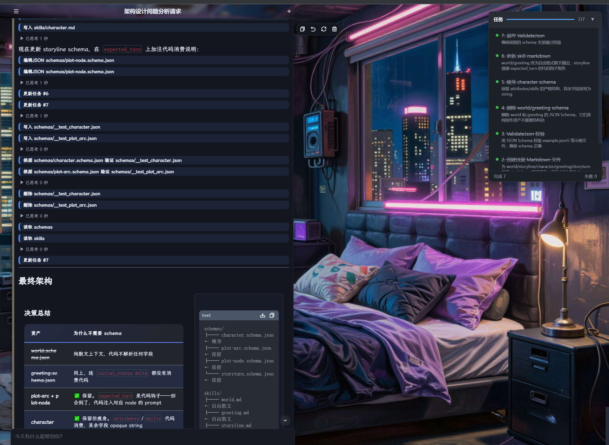

# AiChat - 爱聊天

现代化的高性能纯 Web 多用途 AI 前端，基于 [Unconscious](https://github.com/Roj234/unconscious) 响应式框架。


## 为什么选它

大部分 LLM 前端都是臃肿的 SaaS 复制品，剩下那些基本又是脆弱的周末项目。  
不仅如此，它们还
- “专注一个功能”：只能聊天、只能做项目，或者只能角色扮演。  
- 硬盘杀手：喜欢两万个 py/js 还有比中子星更重的 node_modules 吗
- 内存杀手：bun 对 Windows 的支持还是实验性，issues 里挂着好几个没修的内存泄漏，甚至没法在 cmd.exe 里运行 —— 直接卡死

这是我，一个重度依赖洁癖，内存洁癖，代码体积洁癖，写给自己的项目。

- **前端 2.4MB**，后端加依赖约 650 KB
  - 前端 = 1MB 核心代码 + 可选模块（包含 mermaid 图和办公用的 pdf, docx, xlsx, pptx 读写）
- **只需要浏览器**：Chrome (or WebView) 118+，提供有限的 Firefox 支持。
- **不需要 Docker，不需要编译，不需要 node_modules 和数据库服务**
  - 哪怕连后端都不想要，你的敌人也只有 CORS

## 为什么不选它

- 功能很多，文档很少，上手可能困难。
- 测试较少，可能存在 bug
- 单人项目，可能随时破坏性更改
- 纯前端，无法在无头环境或 Shell 中运行
   - 远程使用方式请查阅文档（WIP）
- 不支持主动缓存写入 —— 你不应该将它接入缓存需要主动写入的模型
   - 你也可以用反向代理修改前端发出的请求，比如写在 sse-proxy 的审核钩子里

## 特性

### 高性能，低内存

> 性能是一种尊重。  
> 我自己就是 AiChat 的深度用户，页面一开就是几天，从未 Out Of Memory，内存几乎不超过 100MB。  
> 你可能会说这有什么特殊的，但我使用 32 位的 Chrome。  
> 相当一部分"现代化"网站会在一下午甚至几分钟内内存溢出，例如 DeepSeek 网页版和模搭社区。

- **流式 Markdown 渲染**：自研解析器，性能优于 `marked`  
正确渲染**“中文引号加粗”**（不符合 CommonMark 规范，但 LLM 输出中很常见）
- **语法高亮**：比 `shiki-stream` 更快，数百 TPS 下流畅不丢帧（大概）
- **虚拟列表**：对话和代码块均使用虚拟滚动
- **按需加载**：Chart.js、KaTeX、Mermaid、语法高亮等按需加载

### Agent & 工具

- **完全可编辑**：事后甚至事前修改任何消息、工具调用参数、结果、思维链
- **本地 Agent**：完整的虚拟文件系统，不需要后端就能操作文件，执行 JS 脚本，创建子代理！
  - 完善且安全的本地 ESM 沙箱，联动文件系统，直接导入文件，还有 `node:fs/promises` 和 `node:path` 可用！
  - 在 OPFS 文件系统中交互式上传和下载文件（夹）
  - 从来没有人！没有人！！如此发挥浏览器的潜力！！！
- **可选后端**：命令执行、文件去重、工作区隔离（`--workspace`）
- **MCP 支持**：接入任何 MCP 服务器
- **记忆系统**：插件化，提供一个符合作者哲学的设计，不满意？反正有 MCP

### 角色扮演

- 支持导入酒馆（SillyTavern）角色卡、世界书、预设（JSON / PNG）
   - 导入，而不是兼容，意味着内部使用自有格式，不支持导出回酒馆。
- 基于工具调用的世界书：精度和省钱吊打正则匹配
- **RPG 管线**（开发中）：使用 JSON Schema 和约束采样，模型**不可能**格式错误

### 用户体验

- **AntiSlop 采样器**：从 token 层面概率拒绝"AI 八股"
- **ZIP 导出**：多媒体不使用 Base64，原始数据体积小，便于查看和编辑
- **请求日志**：每条消息可追溯计费信息
- **TTS & 文生图**：内置工具，BYOEndpoint
- **暗色主题 & 移动端适配**：手机能用，手机好用，还有安卓版
- **断线重连（需后端）**：无线连接断开了？后端替你缓存，像大厂 App 一样！
- **远程控制**：实验性功能，自行激活该内置插件

## 快速开始


> 截图版本 2.20.0

[在线体验](https://roj234.github.io/ai-chat/) 静态版本，或从 [Release](https://github.com/Roj234/ai-chat/releases) 页面下载构建产物：

| 文件                 | 说明 |
|--------------------|------|
| `full_release.zip` | PC 完整版，含前端和后端，解压后运行 `launch.sh` / `launch.bat` |
| `dist.zip`         | 前端文件压缩包，需要自行部署 |
| `AiChat_<版本>.apk`  | 安卓版，最低系统版本 Android 12 |

PC 版默认端口为 3000，可通过 `-p <端口> --data <数据目录>` 参数修改。  
默认不允许命令执行，安全责任属于你，请在容器中运行[专用文件访问服务](public/documents/build.md#命令行参数)
- 尽管如此，回落的JS沙箱也有相当多的API可用

### 静态部署 

把解压后的 `dist/` 扔进任何静态文件服务器：

```bash
# nginx
cp -r dist/* /var/www/html/

# llama-server
llama-server --path ./dist
```

### 使用后端

```bash
./launch.sh
```
或在 windows 上双击 bat  
使用前需要编辑后端配置文件 config.js

开发环境搭建详见[构建指南](public/documents/build.md)。

## 文档

| 文档 | 内容 |
|------|------|
| [使用指南](public/documents/usage.md) | 命令、界面、设置、多模态输入 |
| [构建与部署](public/documents/build.md) | 开发、生产构建、CORS 解决方案 |
| [Agent 与文件系统](public/documents/agent-filesystem.md) | 完全编辑模式、文件访问、安全建议 |
| [高级功能](public/documents/advanced-features.md) | AntiSlop、对话分支、角色扮演基础、思考模式 |
| [RPG 管线](public/documents/rpg-pipeline.md) | 约束采样、流式 JSON 解析 |
| [插件开发](public/documents/plugin-development.md) | 工具注册、命令、后端插件 |
| [API 参考](public/documents/api-reference.md) | SSE 代理、批量请求、WebSocket 同步 |
| [后端配置](public/documents/backend-config.md) | 代理路由、内容审核 |
| [设计哲学](public/documents/philosophy.md) | 设计理念 |
| [路线图](public/documents/roadmap.md) | 已知问题和计划中的功能 |
| [TTS & 生图](public/documents/tts.md) | 端点配置与 API 规范 |

## 依赖

- [Unconscious](https://github.com/Roj234/unconscious) — 无 VDOM 响应式框架
- [streaming-markdown](https://github.com/Roj234/streaming-markdown) — 流式 Markdown 解析器 + KaTeX
- [Remix Icon](https://github.com/Remix-Design/remixicon)
- [Modern Normalize](https://github.com/sindresorhus/modern-normalize)

浏览器需求：Chrome 118+  
在 118-124 上测试  
最低需求最近大概不会改变，新版 Chrome 的 MD3 巨丑

## 按需加载
- [Driver.js](https://driverjs.com/) 新手引导 (30KB)
- [lamejs](https://github.com/zhuker/lamejs) 录音输入 (148KB)
- KaTex (371KB)
- 包含在项目中并 patched： 
   - [highlight.js](https://highlightjs.org/) 语法高亮 (360KB)
   - [Chart.js](https://chartjs.org/) 图表 (197KB)
   - [Mermaid](https://mermaid.js.org/) 还是图表 (2.57MB)

## 沙箱模块
- [PptxGenJS](https://github.com/gitbrent/PptxGenJS) (264KB)
- [SheetJS(mini)](https://git.sheetjs.com/sheetjs/sheetjs) (273KB)
   - 说真的我有一个几十KB的实现，但不支持样式、公式，基本上只能读写文本
- [mathjs](https://mathjs.org/) (635KB)
- [pdf-lib](https://pdf-lib.js.org/) (512KB)
- [docx](https://docx.js.org/) (297KB)

具体有哪些模块详询 AI

## 鸣谢

- [DsChat](https://github.com/huzpsb/DsChat)：可编辑工具调用和 Human-as-tool 的灵感来源
- V8引擎：让原生JS比WASM和Emscripten更快！

## 推荐项目 (See also)

- 我的 [llama.cpp 分支](https://github.com/Roj234/llama.cpp)：兼容 OpenAI 规范的思考开关/预算、JSON Schema 预填充
- [RojLib](https://github.com/Roj234/RojLib)：让你看看什么叫造轮子狂魔

## 许可证

LGPL——详见 [LICENSE](LICENSE) 和[为什么选LGPL](public/documents/license.md)。
