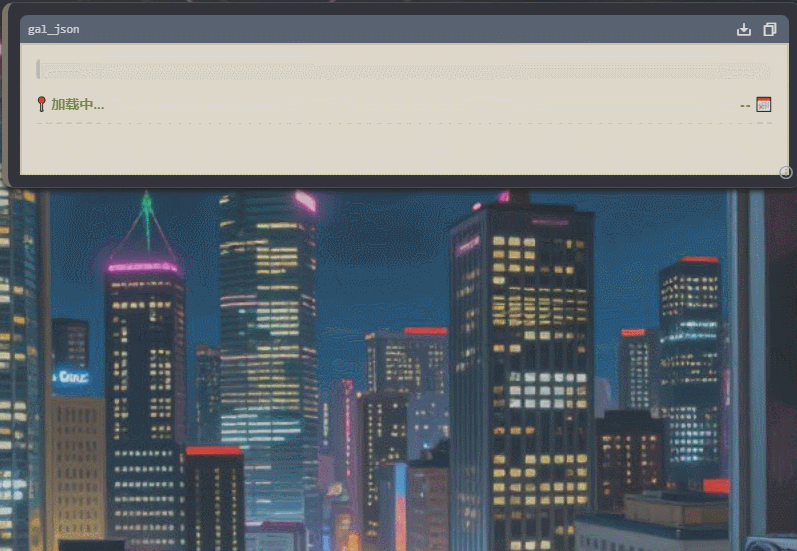

# RPG管线
> 不像某封闭社区的前端角色卡或美化预设，这个方案既不依赖复杂的正则表达式，也不强迫模型完美复述几十KB的模板代码，当然也不*直接*要求模型以XML或JSON标签回复。

### 它好在哪里？
目前的 RP 预设依赖于“祈祷”——祈祷模型能记住 XML 标签，祈祷它不漏掉闭合括号，甚至祈祷它在复述几十 KB 的样板代码时不发疯。我们结束这种混乱。

我们使用**约束采样**：所有的非法 logits 在采样阶段就被过滤。模型**永远**不会忘记格式，**永远**不会生成错误的 JSON。
- **注意力的回归**：当你还在让模型背下复杂的XML标签，一不小心又没闭合，第十次重新生成，你暴跳如雷时，我们将格式交给了数学。模型 100% 的注意力都用于推演剧情，而不是去背诵标签。
- **Token不浪费**：只需要类似 TypeScript+JSDoc 的极简格式注解就可正确生成对象。
- **极高的兼容性**：几乎所有开源闭源模型的API支持通过约束采样生成完美的JSON

### Part1 流式 JSON 解析
  
基于流式 JSON 解析器，UI：
*   **无需等待**：不再需要盯着空白屏幕/破碎的字符串等待回复结束。
*   **流式绑定**：数据到达的瞬间，Markdown 文本、变量状态、选项按钮增量渲染。
*   **节省资源**：不需要每收到一个字符就全量更新一次 HTML

状态：已完成 MVP：
- 给AI使用的[参考手册](./ReactiveJSON.md)，辅助编写Schema和前端
- 【RPG管线Lite】插件，可以自行在 GUI 内启用，代码位于 plugins/rpg/example/StoryTurn.js
   - 使用 `/turn "一句话"` 进行测试
   - 几乎没有系统提示词（除了自动生成的 ~100 tok 的 TS interface）
   - 另有翻译插件 plugins/rpg/example/Translator.js 注册的是 `/translate "内容"`

#### 目前的缺陷
- 基于`response_format`的严格模式，换句话说，只有正规API支持，RP玩家使用正规API的……好吧，我不是在骂你，但是真的不多
    - 如果不支持严格JSON，虽然解析器宽松的支持 JSON5，但无法处理使用中文逗号等情况
- 你需要会写 JavaScript，会用 Vite，或者至少知道怎么样用 vite dev，以那些只会对着GUI点点点，写个正则都能写错，项目靠bug运行的人的水平来说，我很怀疑到底有多少人会开发

### Part2 AI 原生 JSON 编辑器
让 AI 和你协作 JSON，同样基于严格模式和 JSON Schema

状态：已完成
- 【JsonEditor】插件，可以自行在 GUI 内启用，代码位于 plugins/toolset/json_editor.js

### Part3 世界对象模型
构造游戏世界的标准化对象，例如一个【地点】需要什么，一个【人物】需要什么。  
创作者的参考和脚手架

状态：探索中
- 一些 skills

### Part4 RP Harness
一些工具和系统提示词，让 AI 能顺畅的构建和运行 RPG 环境

状态：部分完成
- InteractiveSimulation 工具集，提供骰子、计时器、变量管理和看板等功能
- JsonEditor 工具集
- Subagent 工具集
- FileTransfer 工具集
- 安全代码沙箱

### 游戏开发指南

等4个Part都完工了再写。  
但是肯定需要前端基础。参考 TypeScript 接口定义，编写 JSON Schema，JSX UI 组件等。  
你的代码还会在一个受限的沙箱中运行。

### 附注
“正则表达式”显得像石器时代的工具。  
OpenAI早在2024年就已经实现了支持严格模式的response_format，而本地的llama.cpp更早，我大概也算第一批玩上GBNF的

有人说 tools 和 response_format 和 RP 有什么关系  
如果真的只是对话，那确实没关系，但是你用的什么数据库啊，记忆表格啊，小总结大总结啊，我认为都是无效努力。  
使用各种提示词苦苦哀求模型‘必须写总结，必须包裹在

总结

里面’的时候，数学指令让它只能返回 JSON。  
你看到 Claude Opus 4.6 “几乎可以”遵循你的 Instruction 并且说其他模型能力不行的时候，我这套逻辑能在本地 0.5B 模型上跑通。  
你别管它写的故事有没有逻辑，你就说是不是合法的JSON，有没有总结、变量、记忆等字段吧。

但你也要知道：  
RPG 管线解决的是格式问题（语法），不是质量问题（语义、逻辑、文笔），这只是锦上添花而不是雪中送炭。  
依然要求模型本身有强大的叙事能力，而不是说用了这个框架真的可以0.5B模型跑团。  